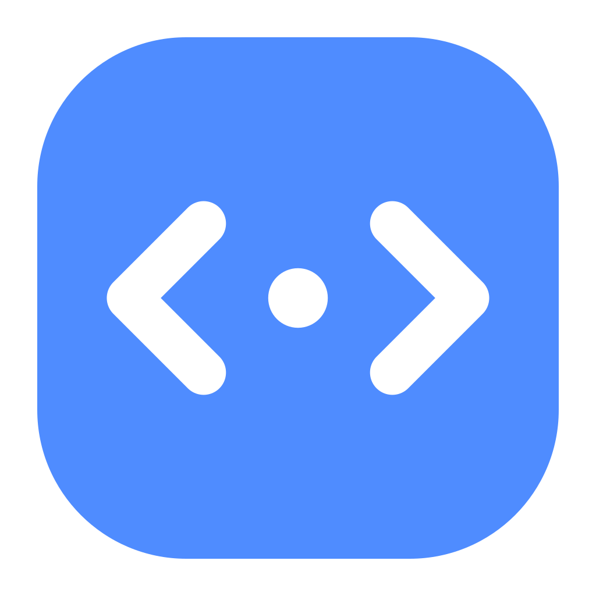
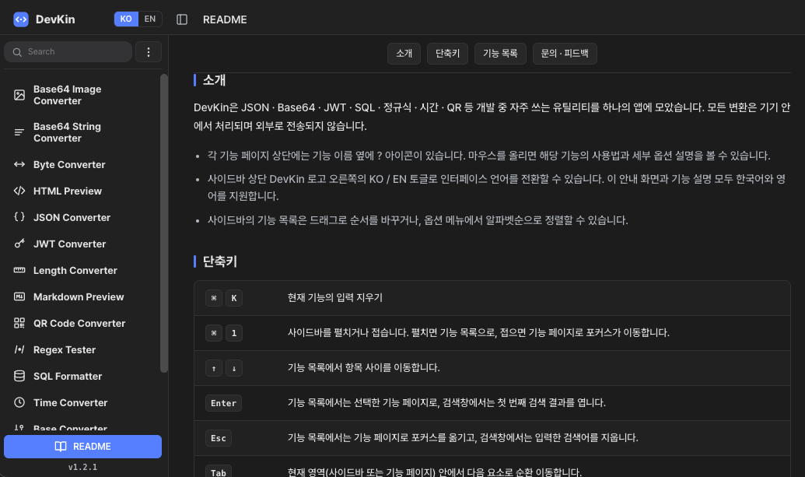
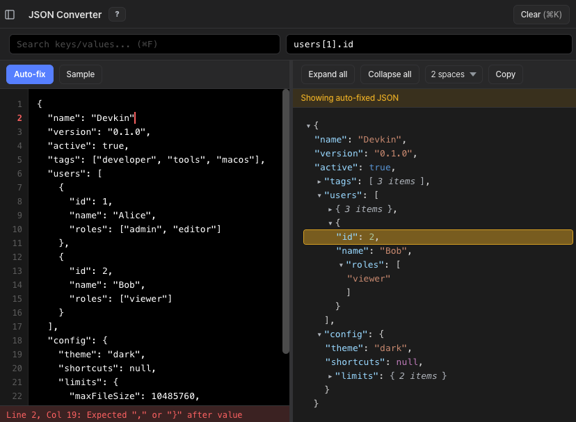
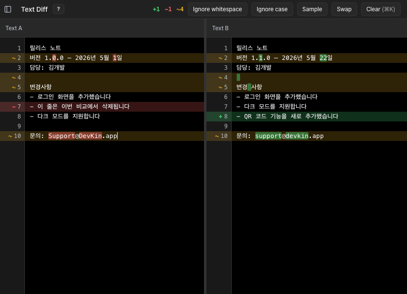
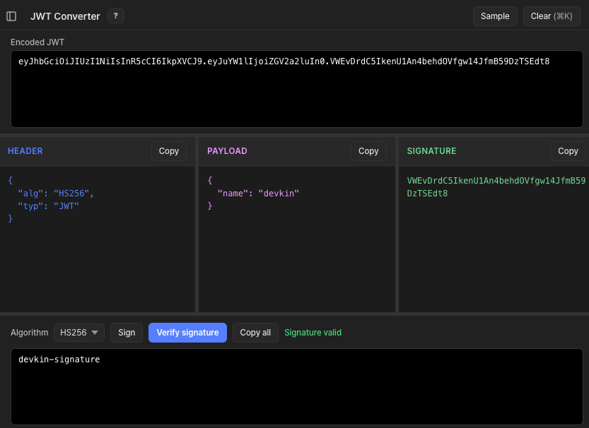
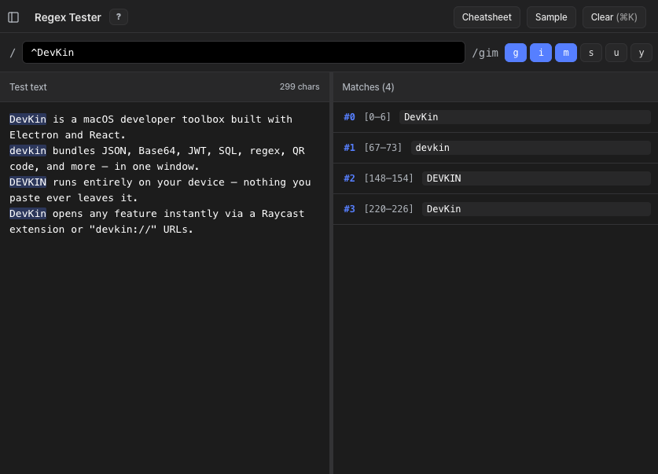

<div align="center">
  <h1> DevKin</h1>
  <p>macOS 개발자를 위한 올인원 툴박스</p>

[](https://github.com/lsh2613/homebrew-devkin/releases)
[](https://github.com/lsh2613/homebrew-devkin/releases/latest)
[](./LICENSE.ko.md)

[한국어](./README.ko.md) | [English](./README.md)
</div>

---

## DevKin이란?



개발하다 보면 반복적으로 필요한 작은 작업들이 있습니다. JSON 확인, Base64 변환, JWT 디코딩, SQL 정렬... 브라우저 탭을 열고, 사이트를 찾고, 입력하는 그 귀찮음을 없애줍니다.

DevKin은 macOS 네이티브 앱으로 자주 쓰는 개발 도구를 한 곳에 담았습니다.

- **빠른 접근** — 여러 가지 기능을 한 곳에서. `devkin://` 딥링크로 원하는 도구를 즉시 실행
- **서드파티 호환** — Raycast, Alfred 등 서드파티 런처의 Quick Link 기능과 호환 가능
- **UX** — 편리한 단축키, 딥링크 시 클립보드 자동 입력, 입력하면 바로 변환, 드래그 앤 드랍, 기능별 샘플

---

## 기능

| 기능 | 설명 | 딥링크 |
|------|------|--------|
| Byte Converter | 한 단위에 값을 입력하면 모든 단위로 즉시 변환 | `devkin://byte` |
| Length Converter | 한 단위에 길이를 입력하면 모든 단위로 즉시 변환 | `devkin://length` |
| Base Converter | 한 진수에 값을 입력하면 다른 모든 진수로 즉시 변환. 2–36진수 Custom 지원 | `devkin://base` |
| JSON Converter | JSON을 계층 트리로 시각화. 텍스트·키 경로 검색, 오류 위치 표시, Auto-fix | `devkin://json` |
| Base64 String Converter | 텍스트 ↔ Base64 문자열 양방향 변환 | `devkin://base64-string` |
| Base64 Image Converter | 이미지 ↔ Base64 양방향 변환. 드래그·붙여넣기, 실시간 미리보기 | `devkin://base64-image` |
| JWT Converter | JWT 토큰 디코딩·검증·서명. HS/RS/ES/PS/EdDSA 지원 | `devkin://jwt` |
| SQL Formatter | SQL 쿼리 자동 정렬. 키워드 케이스·들여쓰기 옵션, 구문 강조 | `devkin://sql` |
| Text Diff | 두 텍스트를 줄·단어 단위로 비교해 추가·삭제·변경을 시각적으로 표시 | `devkin://diff` |
| Text Inspector | 글자 수, 코드 포인트, 단어·줄 수, 인코딩별 바이트 수 | `devkin://text` |
| Markdown Preview | 마크다운 실시간 렌더링. GFM 문법, HTML 복사 | `devkin://md` |
| HTML Preview | HTML 소스 즉시 미리보기. 스크립트 실행 옵션(sandbox) | `devkin://html` |
| QR Code Converter | QR 코드 생성(URL/WiFi/vCard 등) 및 이미지에서 디코딩. PNG/SVG 내보내기 | `devkin://qr` |
| Regex Tester | 정규식 테스트 및 매치 시각화. 6가지 플래그, 캡처 그룹, 치트시트 내장 | `devkin://regex` |
| Time Converter | Local · UTC · KST · Unix 시간 양방향 변환. 단위 토글(s/ms), Custom 포맷 | `devkin://time` |

딥링크는 터미널, Raycast, Alfred, 브라우저 주소창 어디서든 실행됩니다.

```bash
open devkin://json   # 터미널에서 JSON Converter 바로 열기
```

> 딥링크로 기능을 열면 클립보드에 복사해 둔 값이 입력란에 자동으로 채워집니다. 사이드바에서 직접 클릭해 열 때는 자동 입력되지 않습니다.

---

## 기능 미리보기

<table>
  <tr>
    <th width="50%" valign="top">
      JSON
      
    </th>
    <th width="50%" valign="top">
      Diff
      
    </th>
  </tr>
  <tr>
    <th width="50%" valign="top">
      JWT
      
    </th>
    <th width="50%" valign="top">
      Text Inspector
      
    </th>
  </tr>
</table>

---

## 설치

### Homebrew (권장)

```bash
brew trust lsh2613/devkin && brew install --cask lsh2613/devkin/devkin
```

업데이트:

```bash
brew trust lsh2613/devkin && brew upgrade --cask devkin
```

> DevKin은 서드파티 탭에서 배포되어 Homebrew가 신뢰하지 않은 탭의 cask 로드를 거부하므로, 최초 1회 `brew trust`가 필요합니다. 이후 다시 실행해도 무해합니다.

### 직접 다운로드

[GitHub Releases](https://github.com/lsh2613/homebrew-devkin/releases/latest)에서 `.dmg` 파일을 다운로드하여 `/Applications`에 드래그합니다.

> **macOS Gatekeeper 안내**  
> 최초 실행 시 "개발자를 확인할 수 없음" 경고가 뜨면  
> **시스템 설정 → 개인 정보 보호 및 보안 → 그래도 열기** 를 클릭하세요.

---

## 키보드 단축키

| 단축키 | 동작 |
|--------|------|
| `⌘ L` | 사이드바를 펼치고 기능 검색창으로 이동 |
| `⌘ K` | 현재 기능의 입력 지우기 (Clear 버튼이 활성화된 상태에서) |
| `⌘ F` | 현재 기능의 패널 안에서 텍스트 검색·강조 |
| `⌘ T` | 새 탭 열기 (현재 기능 복제) |
| `⌘ W` | 현재 탭 닫기 |
| `⌘ ⇧ [` / `⌘ ⇧ ]` | 이전 / 다음 탭으로 전환 |
| `⌘ 1` | 사이드바 펼치기 / 접기 |
| `↑` / `↓` | 기능 목록에서 항목 이동; 검색창에서는 현재 활성 기능으로 이동 |
| `Enter` | 선택한 기능 열기 / 검색창에서 첫 번째 결과 열기 |
| `Esc` | 기능 페이지로 포커스 이동 / 검색어 지우기 |
| `Tab` | 현재 영역(사이드바 또는 기능 페이지) 내 다음 요소로 순환 이동 |
| 문자 입력 | 기능 목록에 포커스가 있을 때 문자를 입력하면 검색창으로 이동하며 쿼리 시작 |

---

## 요구 사항

- macOS 12 Monterey 이상
- Apple Silicon 및 Intel Mac 지원

---

## 피드백 및 문의

버그 리포트, 기능 제안은 [Issues](https://github.com/lsh2613/homebrew-devkin/issues)에 남겨주세요.  
직접 문의: devkin.2605@gmail.com
