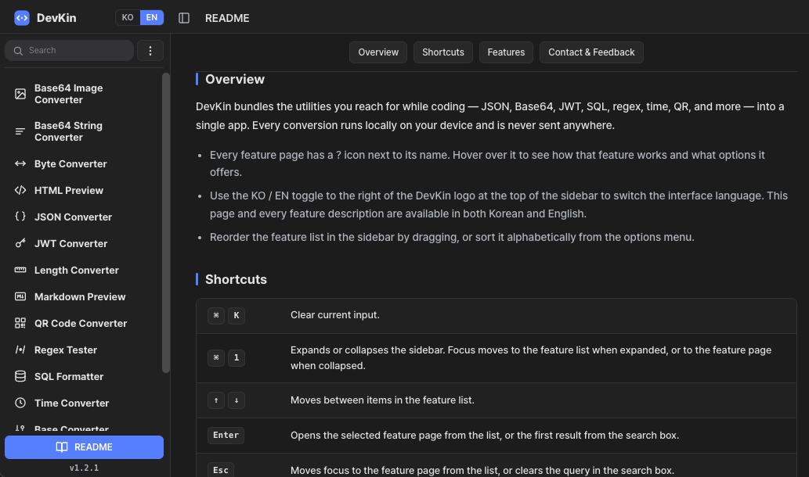

<div align="center">
  <h1> DevKin</h1>
  <p>An all-in-one macOS toolbox for developers</p>

[](https://github.com/lsh2613/homebrew-devkin/releases)
[](https://github.com/lsh2613/homebrew-devkin/releases/latest)
[](./LICENSE.md)

[한국어](./README.ko.md) | [English](./README.md)
</div>

---

## What is DevKin?



There are small tasks you reach for constantly while coding — checking JSON, encoding Base64, decoding a JWT, formatting SQL. DevKin eliminates the friction of opening a browser tab, finding a site, and typing it in.

DevKin is a native macOS app that bundles the developer tools you use most into one place. macOS 12 Monterey or later, Apple Silicon and Intel Mac supported.

- **Instant access** — All tools in one place. Open any tool immediately via the `devkin://` deep link
- **Launcher compatible** — Works with the Quick Link feature of third-party launchers like Raycast and Alfred
- **UX** — Handy shortcuts, clipboard auto-fill on deep link, instant conversion as you type, drag-and-drop, per-feature samples

Bug reports and feature suggestions are welcome at [Issues](https://github.com/lsh2613/homebrew-devkin/issues). Direct contact: devkin.2605@gmail.com

---

## Features

| Feature | Description | Deep Link |
|---------|-------------|-----------|
| Byte Converter | Enter a value in any unit and watch it convert across every unit instantly | `devkin://byte` |
| Length Converter | Enter a length in any unit and watch it convert across every unit instantly | `devkin://length` |
| Base Converter | Enter a value in one base and watch it convert to all other bases instantly. Custom base 2–36 supported | `devkin://base` |
| JSON Converter | Visualize JSON as a navigable tree. Text and key-path search, error location, Auto-fix | `devkin://json` |
| Base64 String Converter | Two-way conversion between plain text and Base64 strings | `devkin://base64-string` |
| Base64 Image Converter | Encode images to Base64 or decode Base64 back into an image. Drag-and-drop, live preview | `devkin://base64-image` |
| JWT Converter | Decode, verify, and sign JWT tokens. Supports HS/RS/ES/PS/EdDSA | `devkin://jwt` |
| SQL Formatter | Auto-format SQL queries. Keyword case, indent options, syntax highlighting | `devkin://sql` |
| Text Diff | Compare two texts line-by-side and word-by-word, highlighting additions, deletions, and changes | `devkin://diff` |
| Text Inspector | Character count, code points, words, lines, and byte size by encoding | `devkin://text` |
| Markdown Preview | Live Markdown rendering. GitHub-Flavored Markdown, copy as HTML | `devkin://md` |
| HTML Preview | Render HTML source instantly. Optional script execution (sandboxed) | `devkin://html` |
| QR Code Converter | Generate QR codes (URL/WiFi/vCard, etc.) or decode from an image. Export as PNG/SVG | `devkin://qr` |
| Regex Tester | Test regular expressions with live match visualization. 6 flags, capture groups, built-in cheatsheet | `devkin://regex` |
| Time Converter | Two-way conversion across Local, UTC, KST, and Unix time. Unit toggle (s/ms), custom format | `devkin://time` |

Deep links work from anywhere — terminal, Raycast, Alfred, browser address bar.

```bash
open devkin://json   # Open JSON Converter directly from the terminal
```

> Opening a feature through a deep link auto-fills the input with whatever you copied to the clipboard. Clicking a feature directly in the sidebar does not auto-fill.

---

## Feature Preview

<table>
  <tr>
    <th width="50%" valign="top">
      JSON
      
    </th>
    <th width="50%" valign="top">
      Diff
      
    </th>
  </tr>
  <tr>
    <th width="50%" valign="top">
      JWT
      
    </th>
    <th width="50%" valign="top">
      Text Inspector
      
    </th>
  </tr>
</table>

---

## Installation

### Homebrew (recommended)

```bash
brew trust lsh2613/devkin && brew install --cask lsh2613/devkin/devkin
```

Update:

```bash
brew trust lsh2613/devkin && brew upgrade --cask devkin
```

> `brew trust` is required once because DevKin ships from a third-party tap; Homebrew refuses to load casks from untrusted taps. Trusting it again on later runs is harmless.

### Direct download

Download the `.dmg` from [GitHub Releases](https://github.com/lsh2613/homebrew-devkin/releases/latest) and drag it to `/Applications`.

> **macOS Gatekeeper notice**  
> If you see "Apple cannot verify the developer" on first launch,  
> go to **System Settings → Privacy & Security → Open Anyway**.

---

## Keyboard Shortcuts

| Shortcut | Action |
|----------|--------|
| `⌘ L` | Expand the sidebar and focus the feature search box |
| `⌘ K` | Clear the current feature's input (when the Clear button is enabled) |
| `⌘ F` | Search and highlight text within the current feature's panes |
| `⌘ T` | Open a new tab (duplicates the active feature) |
| `⌘ W` | Close the active tab |
| `⌘ ⇧ [` / `⌘ ⇧ ]` | Switch to the previous / next tab |
| `⌘ 1` | Expand / collapse the sidebar |
| `↑` / `↓` | Move between items in the feature list; from the search box, step to the active feature |
| `Enter` | Open the selected feature / open the first search result |
| `Esc` | Move focus to the feature page / clear the search query |
| `Tab` | Cycle to the next element within the current area (sidebar or feature page) |
| Type any character | While in the feature list, typing focuses the search box and starts a new query |

---

## Requirements

- macOS 12 Monterey or later
- Apple Silicon and Intel Mac supported

---

## Feedback & Contact

Bug reports and feature suggestions are welcome at [Issues](https://github.com/lsh2613/homebrew-devkin/issues).  
Direct contact: devkin.2605@gmail.com
